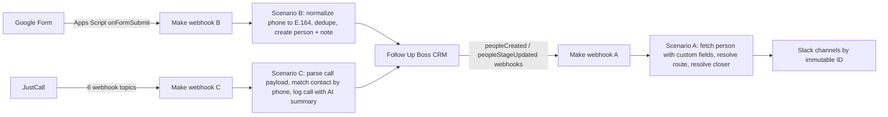

# Real Estate CRM Automation Suite

Production integration suite built for a US real estate wholesaling company. It connects the company's CRM (Follow Up Boss), its phone system (JustCall), Slack, and a Google Forms lead intake channel into one event-driven system that the sales team runs their day on.

Everything here ran in production. Client identifiers, credentials, live webhook URLs, channel IDs, and staff names have been replaced with fictional equivalents so the engineering can be shown publicly. The logic, the architecture, and the tooling are the real thing.

## What it does

| Pipeline | Trigger | Result |
|----------|---------|--------|
| A. Stage notifications | CRM person created or deal stage changes | Formatted Slack message routed to the right channel, including per-closer channels and a catch-all so nothing is dropped |
| B. Cold lead intake | SMS agency submits a Google Form | Deduplicated person created in the CRM at the correct stage with the correct tag, lead manager assigned round-robin |
| C. Call and SMS mirror | JustCall call completes, AI summary generated | Call logged on the matching CRM contact with recording link, AI summary, call score, topics, and customer sentiment |

## Architecture



Three Make.com scenarios, all triggered by webhooks rather than polling, all authored and maintained programmatically through the Make API from the Python generators in `make/`. A parallel n8n implementation of pipelines A and B lives in `n8n/`, generated from the same tested logic core.

## Engineering decisions worth reading

These are documented in depth in [docs/engineering-notes.md](docs/engineering-notes.md). The short version:

**Webhooks over polling, for money reasons.** Make.com charges per operation. The native "watch" triggers poll every minute and would have burned roughly 43,000 operations per month while idle. Registering CRM webhooks against a custom Make webhook brought each event down to about 3 operations, which keeps the whole system inside a 10,000 operation plan.

**A tested logic core that both platforms consume.** Routing rules, phone normalization, field extraction, and Slack message building live in `shared/lib` as plain JavaScript with a 26-assertion test suite. The n8n workflows are generated from it. The Make blueprints follow it. Business logic was never hand-copied into a GUI.

**Scenarios as code.** Make scenarios are usually built by clicking. Here they are generated by Python scripts (`make/build_make_part*.py`), created and updated through the Make API, patched surgically when requirements changed (see the `make/patch_*.py` series, each one a dated, reviewable change), and documented with color-coded module notes posted through the API. Credentials are injected from the environment at deploy time and never live in the repo.

**Race conditions found by watching production.** The original call logging design wrote a basic call record immediately and enriched it when the AI summary arrived later. A delayed AI event could match the wrong call and overwrite a real one, which happened in production exactly once before the design was changed to a single-step write where every AI event produces one self-contained record.

**Platform quirks handled explicitly.** Make evaluates `null = ""` as false, so every emptiness guard uses `ifempty()`. This one behavior caused three separate bugs (blank addresses rendered as ", , ", dropped calls, malformed notes) before it was identified as a bug class and eliminated everywhere.

**Verified by firing real events, not by trusting dashboards.** Every route was tested end to end by sending controlled webhook payloads and confirming the Slack post or CRM record, against staging channels first, with a one-command switch between staging and production channel maps.

## Repository tour

```
shared/lib/          Tested logic core: routes, channel registry, closer routing,
                     E.164 phone normalization, Slack Block Kit builders, test suite
shared/slack-messages/  Renders every message template to reviewable markdown
shared/fub-scripts/  CRM inspection and webhook registration utilities (Python)
make/                The live build: blueprint generators, API client,
                     surgical patch scripts, live end-to-end test scripts
google-form/         Apps Script intake form: instant webhook push, retry queue,
                     round-robin lead manager assignment with a locked counter
n8n/                 Parallel n8n implementation, generated from shared/lib
docs/                Architecture and engineering notes
```

## Running the tests

```
npm test
```

runs the 26 assertions covering stage routing, closer resolution and fallback, phone normalization edge cases, field extraction, and message formatting.

## Stack

Make.com (API-authored scenarios), n8n, Follow Up Boss API, JustCall API v2.1, Slack Block Kit, Google Apps Script, Node.js, Python.

## Author

Alexey. Built as a freelance engagement in 2026; published with the client's details anonymized.
